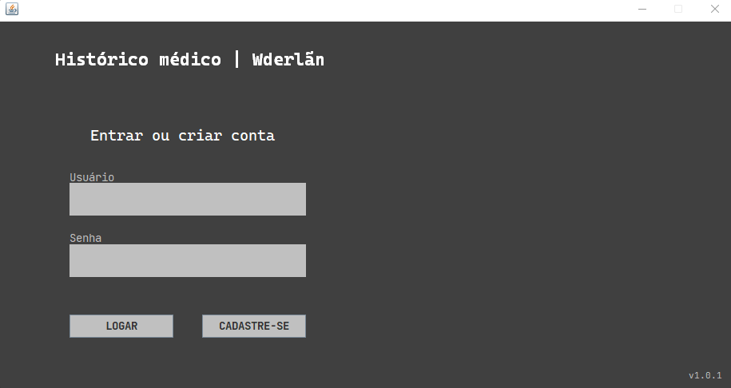

# README

 Projeto: Histórico Médico CuboMV 

## Sobre

  Mini projeto realizado com Windows Builder para fortalecer pontos como validações e tratativas de erros. 

## Tecnologias

- Java

## Autor

 - [Wderlãn Silva](https://www.linkedin.com/in/wderlansilva/)

## Preview

 

